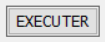

# hogwarts-mystery-script-auto-clicker
Ce projet a pour but de générer des scripts pour automatiser des tâches pour une journée de jeux.

Pour toute participation, question, demande (ajout de licence comercial...), détaile et contact :  
[Contact et suport](#contact-et-suport)

Ce(tte) œuvre est mise à disposition selon les termes de la :  
> <a rel="license" href="http://creativecommons.org/licenses/by-nc-sa/4.0/">Licence Creative Commons Attribution - Pas d’Utilisation Commerciale - Partage dans les Mêmes Conditions 4.0 International</a>.  
> 1) Avec réstriction de la distribution du code source sous  
> [Licence GPLv3](https://www.gnu.org/licenses/gpl-3.0.html) [ [License compatiblility : CC BY-NC-SA 4.0/GPLv3](https://creativecommons.org/share-your-work/licensing-considerations/compatible-licenses) | [License compatiblility Wiki : CC BY-NC-SA 4.0/GPLv3](https://wiki.creativecommons.org/wiki/ShareAlike_compatibility:_GPLv3) ]  
> 2) Avec réstriction Partager/Copier/Redistribuer/Modifier : Doit être sans frai, valider et ajouter au dépot sous :   
> [License Lha](https://directory.fsf.org/wiki/License:Lha) & 
> [License RHeCos-1.1](https://directory.fsf.org/wiki/License:RHeCos-1.1) & 
> [License Aladdin](https://directory.fsf.org/wiki/License:Aladdin) en plus de la [Licence Creative Commons BY-NC-SA](https://creativecommons.org/licenses/by-nc-sa/4.0/legalcode) & [Licence GPLv3](https://www.gnu.org/licenses/gpl-3.0.html)

Vous aimez ce projet ? Merci de nous [Soutenir](#soutenir) pour l'améliorer!

-----------------------------------------------------------------------------------------------------------------------------------------------------------------
- [hogwarts-mystery-script-auto-clicker](#hogwarts-mystery-script-auto-clicker)
  - [Usage](#usage)
    - [Interface graphique](#interface-graphique)
      - [Prérequis interface graphique](#prérequis-interface-graphique)
      - [Utilisation interface graphique](#utilisation-interface-graphique)
      - [Modification interface graphique](#modification-interface-graphique)
    - [Script](#script)
      - [Prérequis script](#prérequis-script)
      - [Utilisation script](#utilisation-script)
        - [Avec l'interface graphique](#avec-interface-graphique)
        - [Manuelment](#manuelment)
      - [Modification script](#modification-script)
        - [Mode Débug](#mode-débug)
  - [Soutenir](#soutenir)
    - [Parainage](#parainage--earnapp--sweatcoin)
    - [Cagnotte](#cagnotte--lydia-0-de-taxe--leetchi-2-de-taxe)
    - [Abonement et donnation](#abonement-et-donnation--paypal--transactions-supérieures-ou-égales-à-1001-eur-060--de-taxe)
  - [Contact et suport](#contact-et-suport)
---------------------------------------------------------------------------------------------------------------------------------------------------------------

<h2>Usage</h2> : 

  

  
<h3>Interface graphique</h3> : 

    

    
<h4>Prérequis interface graphique</h4> : 

    1) Systeme d'expoitation sous windows
    

    

    
<h4>Utilisation interface graphique</h4> : 

    <ol>
      <li>
         <ul>
          <li>Lancer le <a rel="main.exe" href="/main.exe">main.exe</a> à la 
            <a rel="racine du projet" href="https://github.com/JoDylan404/hogwarts-mystery-script-auto-clicker">racine du projet</a>.</li>
           ------- ou --------- 
          <li>Lancer 
            <a rel="/hogwarts-mystery-script-auto-clicker" href="/hogwarts-mystery-script-auto-clicker">hogwarts-mystery-script-auto-clicker</a> \
            <a rel="/hogwarts-mystery-script-auto-clicker/SCRIPT_HOGWARD_MYSTERY.exe" 
               href="/hogwarts-mystery-script-auto-clicker/SCRIPT_HOGWARD_MYSTERY.exe">SCRIPT_HOGWARD_MYSTERY.exe</a>.
          </li>
        </ul>
      <li>
        Renseigner les lieux et item dans la fenêtre accesible depuit l'onglet lieu et item du menu et selectioner "OK".
      <li>
        Selectioner les parametre de l'instance d'execution du scripte dans l'interface graphyque.
      <li>
        Cliquer sur "Executer"    dans l'interface graphyque.
      <li>
        Le script s'execute
      </li>
    </ol>
    

    

    
<h4>Modification interface graphique</h4> : 

    <ol>
      <li>
        Utiliser les fichier hogwarts-mystery-script-auto-clicker\DataScript\ [Data*](hogwarts-mystery-script-auto-clicker/DataScript/) pour les commandes des instances du script à éffectuer et pour afficher la progression : ([DataExec](hogwarts-mystery-script-auto-clicker/DataScript/DataExec), [DataItem](hogwarts-mystery-script-auto-clicker/DataScript/DataItem), [DataLieu](hogwarts-mystery-script-auto-clicker/DataScript/DataLieu), [DataLog](hogwarts-mystery-script-auto-clicker/DataScript/DataLog), [DataProg](hogwarts-mystery-script-auto-clicker/DataScript/DataProg)...)
      </li>
    </ol>
    <ul>
      <li>
      </li>
    </ul>
    

  

  

  
<h3>Script</h3> : 

    

    
<h4>Prérequis script</h4> : 

    

    

    
<h4>Utilisation script</h4> : 

      

      
<h5>Avec interface graphique</h5> : 

      

      

      
<h5>Manuelment</h5> : 

      

    

    

    
<h4>Modification script</h4> : 

      

      
<h5>Mode Débug</h5> : 

      

    

  

<h2>Soutenir</h2> : 

  

  
<h3>Parainage</h3> : 

  

  

  
<h3>Cagnotte</h3> : 

  

  

  
<h3>Abonement et donnation</h3> : 

  

<h2>Contact et suport</h2> : 

## Usage
### Interface graphique
#### Prérequis interface graphique
1) Systeme d'expoitation sous windows
#### Utilisation interface graphique
1)
    - Lancer le [main.exe](/main.exe "main.exe") à la [racine du projet](https://github.com/JoDylan404/hogwarts-mystery-script-auto-clicker).
    
      ------- ou ---------
    - Lancer [hogwarts-mystery-script-auto-clicker](/hogwarts-mystery-script-auto-clicker)\ [SCRIPT_HOGWARD_MYSTERY.exe](/hogwarts-mystery-script-auto-clicker/SCRIPT_HOGWARD_MYSTERY.exe)
2) Renseigner les lieux et item dans la fenêtre accesible depuit l'onglet lieu et item du menu et selectioner "OK".
3) Selectioner les parametre de l'instance d'execution du scripte dans l'interface graphyque.
3) Cliquer sur "Executer"  dans l'interface graphyque.
4) le script s'execute
#### Modification interface graphique
1) Utiliser les fichier hogwarts-mystery-script-auto-clicker\DataScript\ [Data*](hogwarts-mystery-script-auto-clicker/DataScript/) pour les commandes des instances du script à éffectuer et pour afficher la progression : ([DataExec](hogwarts-mystery-script-auto-clicker/DataScript/DataExec), [DataItem](hogwarts-mystery-script-auto-clicker/DataScript/DataItem), [DataLieu](hogwarts-mystery-script-auto-clicker/DataScript/DataLieu), [DataLog](hogwarts-mystery-script-auto-clicker/DataScript/DataLog), [DataProg](hogwarts-mystery-script-auto-clicker/DataScript/DataProg)...)
- Pour demander la creation d'une branche et ajouter votre interface graphique au projet suivez les lien [Contact et suport](#contact-et-suport).

  ajouter votre nom GitHub au fichier modifier exemple : *-nomGitHub.json

  merci de formuler votre demande en utilisant les template dans ".github/ [ISSUE_TEMPLATE](.github/ISSUE_TEMPLATE/)" ([bug_report.md](.github/ISSUE_TEMPLATE/bug_report.md), [custom.md](.github/ISSUE_TEMPLATE/custom.md), [feature_request.md](.github/ISSUE_TEMPLATE/feature_request.md))

### Script
#### Prérequis script
1) Systeme d'exploitation sous window.
2) Emulateur androide comme Blue Stack.
3) Le jeux Hogwarts Mystery installer sur l'emulateur.
#### Utilisation script
###### Avec interface graphique
  1)
      - Lancer le [main.exe](/main.exe "main.exe") à la [racine du projet](https://github.com/JoDylan404/hogwarts-mystery-script-auto-clicker).
    
        ------- ou ---------
      - Lancer [hogwarts-mystery-script-auto-clicker](/hogwarts-mystery-script-auto-clicker)\ [SCRIPT_HOGWARD_MYSTERY.exe](/hogwarts-mystery-script-auto-clicker/SCRIPT_HOGWARD_MYSTERY.exe)
  2) Renseigner les lieux et item dans la fenêtre accesible depuit l'onglet lieu et item du menu et selectioner "OK".
  3) Selectioner les parametre de l'instance d'execution du scripte dans l'interface graphyque.
  4) Cliquer sur "Executer"  dans l'interface graphyque.
  5) Le script s'execute
###### Manuelment
  1) Utiliser les fichier hogwarts-mystery-script-auto-clicker\DataScript\ [Data*](hogwarts-mystery-script-auto-clicker/DataScript/) pour les commandes des instances du script à éffectuer et pour afficher la progression : ([DataExec](hogwarts-mystery-script-auto-clicker/DataScript/DataExec), [DataItem](hogwarts-mystery-script-auto-clicker/DataScript/DataItem), [DataLieu](hogwarts-mystery-script-auto-clicker/DataScript/DataLieu), [DataLog](hogwarts-mystery-script-auto-clicker/DataScript/DataLog), [DataProg](hogwarts-mystery-script-auto-clicker/DataScript/DataProg)...)
  2) Lancer SourceScript\AMK\ [AMK_v6.3.8.6](SourceScript/AMK/AMK_v6.3.8.6)\ [AutoMouseKey.exe](SourceScript/AMK/AMK_v6.3.8.6/AutoMouseKey.exe) et ouvrer le fichier [hogwarts-mystery-script-auto-clicker](hogwarts-mystery-script-auto-clicker)\ [instance.json](hogwarts-mystery-script-auto-clicker/instance.json)
  3) Cliquer sur "PLAY"  ou ["Shif" + "F1"]
  4) Le script s'execute
#### Modification script
1) Lancer SourceScript\AMK\ [AMK_v6.3.8.6](SourceScript/AMK/AMK_v6.3.8.6)\ [AutoMouseKey.exe](SourceScript/AMK/AMK_v6.3.8.6/AutoMouseKey.exe) et ouvrer le fichier [hogwarts-mystery-script-auto-clicker](hogwarts-mystery-script-auto-clicker)\ [instance.json](hogwarts-mystery-script-auto-clicker/instance.json)
2) modifier et enregistrer les modification dans [hogwarts-mystery-script-auto-clicker](hogwarts-mystery-script-auto-clicker)
3) Utiliser les fichier hogwarts-mystery-script-auto-clicker\DataScript\ [Data*](hogwarts-mystery-script-auto-clicker/DataScript/) pour les commandes des instances du script à éffectuer et pour afficher la progression : ([DataExec](hogwarts-mystery-script-auto-clicker/DataScript/DataExec), [DataItem](hogwarts-mystery-script-auto-clicker/DataScript/DataItem), [DataLieu](hogwarts-mystery-script-auto-clicker/DataScript/DataLieu), [DataLog](hogwarts-mystery-script-auto-clicker/DataScript/DataLog), [DataProg](hogwarts-mystery-script-auto-clicker/DataScript/DataProg)...)
4) ##### Mode Débug 
    > Aprés modification, vous pouvez executer le script étape par étape en selectionant le mode debug 
    
- Pour demander la creation d'une branche et ajouter votre script au projet suivez les lien [Contact et suport](#contact-et-suport).

  ajouter votre nom GitHub au fichier modifier exemple : *-nomGitHub.json
  
    merci de formuler votre demande en utilisant les template dans ".github/ [ISSUE_TEMPLATE](.github/ISSUE_TEMPLATE/)" ([bug_report.md](.github/ISSUE_TEMPLATE/bug_report.md), [custom.md](.github/ISSUE_TEMPLATE/custom.md), [feature_request.md](.github/ISSUE_TEMPLATE/feature_request.md))
---------------------------------------------------------------------------------------------------------------------------------------------------------------
## Soutenir
> ##### Parainage : <a href="https://earnapp.com/i/83x6lce">EarnApp</a> | <a href="https://sweatco.in/hi/jodylan">SweatCoin</a>
> ##### Cagnotte : <a href="https://lydia-app.com/pots?id=hogwarts-mystery-script-auto-clicker">Lydia</a> 0% de taxe | <a href="https://www.leetchi.com/c/script-auto-clicker-hogwarts-mystery">Leetchi</a> 2% de taxe
> ##### Abonement et donnation : <a href="https://www.paypal.com/donate/?hosted_button_id=2LXKW9JGBMFM6">PayPal</a>  Transactions Supérieures ou égales à 10,01 EUR 0,60 % de taxe
## Contact et suport
#### Pour toute participation, question, demande, détaile et contact : 
> ###### Facebook : https://www.facebook.com/groups/2049128385357987/permalink/3377153605888785/
> ###### Reddit : https://www.reddit.com/r/HogwartsMysteryHP/comments/110psh4/script_auto_clicker_for_hogwarts_mystery/
> ###### Email : john19911991@hotmail.fr
###### Merci de formuler votre demande en utilisant si possible les template dans : ".github/ [ISSUE_TEMPLATE](.github/ISSUE_TEMPLATE/)" ([bug_report.md](.github/ISSUE_TEMPLATE/bug_report.md), [custom.md](.github/ISSUE_TEMPLATE/custom.md), [feature_request.md](.github/ISSUE_TEMPLATE/feature_request.md))".
This work is licensed under the Creative Commons Attribution-NonCommercial-ShareAlike 4.0 International License :  
> * Avec réstriction pour les conditions spécifiques concernant la distribution du code source :  
> [Licence GPLv3](https://www.gnu.org/licenses/gpl-3.0.html) [ [License compatiblility : CC BY-NC-SA 4.0/GPLv3 ](https://wiki.creativecommons.org/wiki/ShareAlike_compatibility:_GPLv3) ]  
> * Avec restriction pour Partager copier redistribuer le matériel sur n'importe quel support ou format :  
    - Doit être sans frai, valider et ajouter au dépot.  
  * To view a copy of this license, visit http://creativecommons.org/licenses/by-nc-sa/4.0/ or send a letter to Creative Commons, PO Box 1866, Mountain View, CA 94042, USA.
---
By [JoDylan404](https://github.com/JoDylan404)
